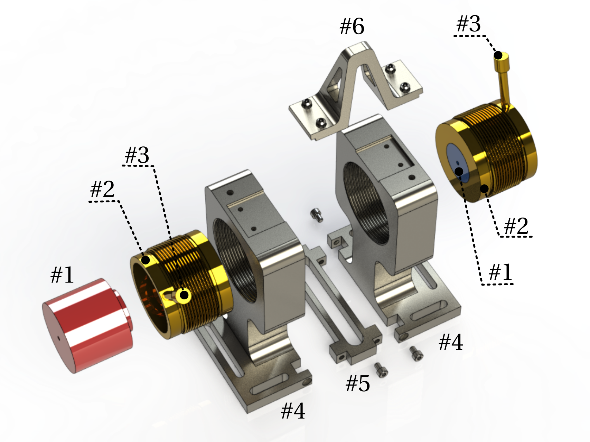

High magnetic field atomic spectroscopy (up to 1 Tesla)
=======================================================

Design of a custom permanent magnet pair and their holder that
allows application of the magnetic fields of up to 1 T
in the gap between the magnets.
Central bore in the magnets allows laser beam access for laser spectroscopy
of atomic vapour contained in a spectroscopic cell placed between the magnets.
A distance between the magnets can be adjusted, continuously adjusting magnetic
field.

This is a part of the setup used for providing frequency reference for laser
locking for atomic physics experiments. As a part of optical setup for
Zeeman Shifted Atomic Reference (ZSAR), it can provide locking signal for lasers
up to ~19 GHz away from the unperturbed D transitions in Rubidium atoms.
Signal is generated from sub-Doppler spectroscopy of atomic transitions,
has low drift siutable for atomic physics experiments, and can be controllably
tuned in wide range of frequencies. For more details see reference below.

File list and assembly
----------------------

| Label   |      Title      |  File types | Material | Manufacturing method/supplier| Quantity |
|:----:|:---|:------:|:------:|:------:|:------:|
| #1 | magnet | .step, .stl, | NdFeB |  [first4magnets](https://www.first4magnets.com/) | x2, opposite polarity |
| #2 | magnet_holder  | .step, .stl | brass | CNC milling | x2 |
| #3 | handle |    .step, .stl, | brass | CNC milling | x2 |
| #4 | magnet_body_holder | .step, .stl | aluminium | CNC milling, sand blasted | x2 |
| #5 | magnet_base_separator | .step, .stl, | aluminium | CNC milling, sand blasted | x1 |
| #6 | top_magnet_holder_separator | .step, .stl, | aluminium | CNC milling, sand blasted | x1|

Click on individual .stl files in `parts/` folder to *see 3D parts* in browser.
Technical drawings for all parts are provided in `parts/technical_drawings.pdf`.
Schematics of *full assembly* is provided in `assembly/`.
Photo of *assembled setup* setup is provided in `assembly/photo_of_assembly.jpg`.

Note that two magnets have their north and south poles oriented such that
they form Helmholtz pair.

Reference / Cite as
-------------------

Original design: [Massayuki Kondo](http://www.atomobrasil.com/)
(Federal University of Santa Catarina, UFSC, Florianópolis, Brasil);
Modifications: [Dominic Reed](https://www.jqc.org.uk/members/dominic-reed/)
(Durham University, Durham, UK)

**Cite as:** [D. J. Reed, N. Šibalić, D. J. Whiting, J. M. Kondo, C. S. Adams, K. J. Weatherill, "Low-drift Zeeman shifted atomic frequency reference", *OSA Continuum* **1**, 4-12 (2018)](https://doi.org/10.1364/OSAC.1.000004).

Licence
-------
All distributed files are provided subject to
Creative Commons - Attribution 3.0 license (CC BY 3.0).
A copy of the license is provided.
